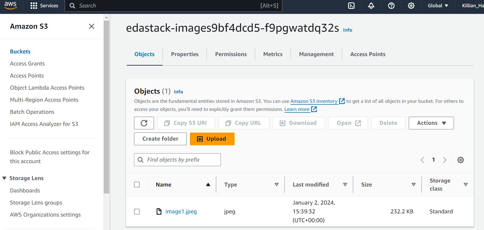
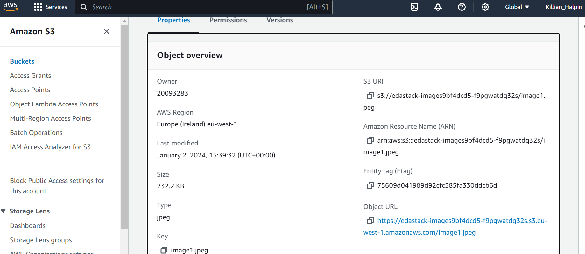
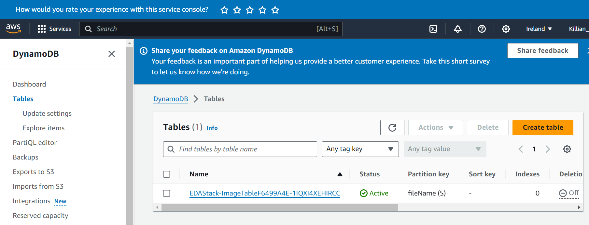

EDA Assignment - Distributed Systems.
Name: Killian Halpin 20093283

YouTube Demo link - [The URL of your demonstration of the app.]

Phase 1.
[ List the Lambda functions in this phase's architecture and state their working status.]

Image bucket is working 

Table is also created

Phase 2 (if relevant).
[ List the Lambda functions in this phase's architecture and state their working status.]

e.g.

Confirmation Mailer - Fully implemented.
Rejection Mailer - Fully implemented.
Process Image - Fully implemented
Process Delete - Partially implemented.
Update Table - Not implemented.
Phase 3 (if relevant).
[ List the Lambda functions in this phase's architecture and state their working status.]

e.g.

Confirmation Mailer - Fully implemented.
Rejection Mailer - Fully implemented.
Process Image - Fully implemented
etc
etc
